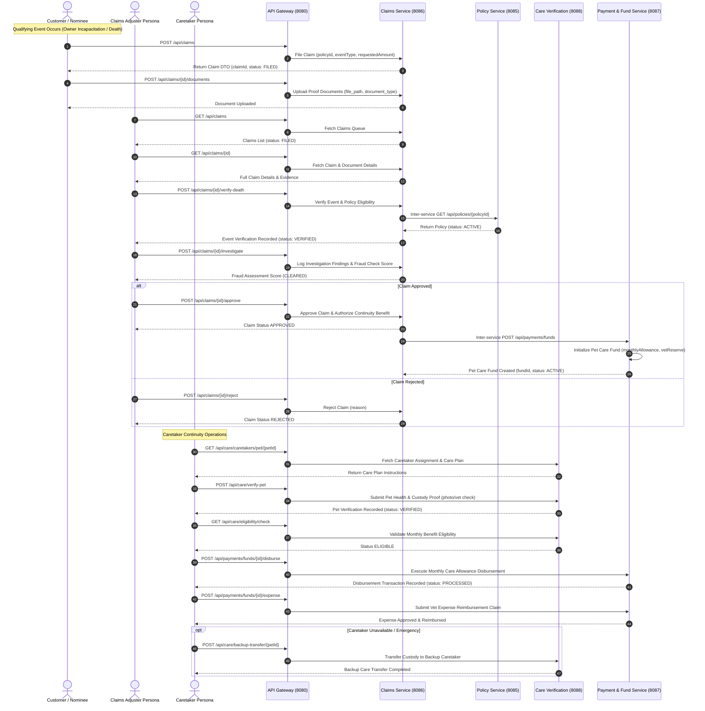

# Pet Continuity Assurance System - Claims & Continuity Fund Workflow Diagram

This document contains the detailed end-to-end Mermaid sequence and flowchart diagrams for the **Claims Filing, Event Verification, Fraud Assessment, Approval, and Pet Care Continuity Fund Disbursement Workflow**, including explicit actions for **Customer**, **Claims Adjuster Persona**, **Caretaker Persona**, **Claims Service**, **Care Verification Service**, and **Payment & Fund Service**.

---

## 1. Claims & Continuity Fund Flowchart

```mermaid
flowchart TD
    subgraph QUALIFYING_EVENT ["Qualifying Event & Claim Filing"]
        E1[Qualifying Event Occurs: Hospitalization / Death] --> E2[Customer / Delegate Files Claim /api/claims]
        E2 --> E3[Upload Proof Documents /api/claims/id/documents]
        E3 --> E4[Claim Status: FILED]
    end

    subgraph CLAIMS_ADJUSTER_ACTIONS ["Claims Adjuster Persona Actions"]
        E4 --> F1[Claims Officer Views Queue /api/claims]
        F1 --> F2[Inspect Claim Evidence & Documents]
        F2 --> F3[Verify Event /api/claims/id/verify-death]
        F3 --> F4[Verify Policy Status via WebClient]
        F4 --> F5[Conduct Eligibility Investigation /api/claims/id/investigate]
        F5 --> F6[Execute Automated Fraud Check]
        F6 --> F7{Adjuster Approval Decision}
        F7 -- Rejected --> F8[Status: REJECTED / Reason Logged]
        F7 -- Approved --> F9[Status: APPROVED / Benefit Amount Authorized]
    end

    subgraph CONTINUITY_FUND_PROVISIONING ["Pet Care Continuity Fund Provisioning"]
        F9 --> G1[Provision Pet Care Fund /api/payments/funds]
        G1 --> G2[Allocate Total Fund, Monthly Allowance & Vet Reserve]
        G2 --> G3[Fund Status: ACTIVE]
    end

    subgraph CARETAKER_OPERATIONS ["Caretaker Verification & Disbursement"]
        G3 --> H1[Primary Caretaker Views Assignment /api/care/caretakers/pet/petId]
        H1 --> H2[Submit Pet Verification Proof /api/care/verify-pet]
        H2 --> H3[Check Disbursement Eligibility /api/care/eligibility/check]
        H3 --> H4{Eligibility Validated?}
        H4 -- Verified --> H5[Disburse Monthly Allowance /api/payments/funds/id/disburse]
        H4 -- Failed Verification --> H6[Suspend Fund Disbursement /api/payments/funds/id/status]
        H5 --> H7[Caretaker Submits Vet Expense Claim /api/payments/funds/id/expense]
        H7 --> H8[Reimburse Approved Vet Expense]

        H6 --> H9[Trigger Transfer to Backup Caretaker /api/care/backup-transfer/petId]
        H9 --> H10[Backup Caretaker Assumes Primary Custody]
        H10 --> H2
    end

    classDef event fill:#fee2e2,stroke:#dc2626,stroke-width:2px;
    classDef adjuster fill:#fef3c7,stroke:#d97706,stroke-width:2px;
    classDef fund fill:#dcfce7,stroke:#16a34a,stroke-width:2px;
    classDef caretaker fill:#e0f2fe,stroke:#0284c7,stroke-width:2px;

    class E1,E2,E3,E4 event;
    class F1,F2,F3,F4,F5,F6,F7,F8,F9 adjuster;
    class G1,G2,G3 fund;
    class H1,H2,H3,H4,H5,H6,H7,H8,H9,H10 caretaker;
```

---

## 2. Claims & Continuity Fund Detailed Sequence Diagram

