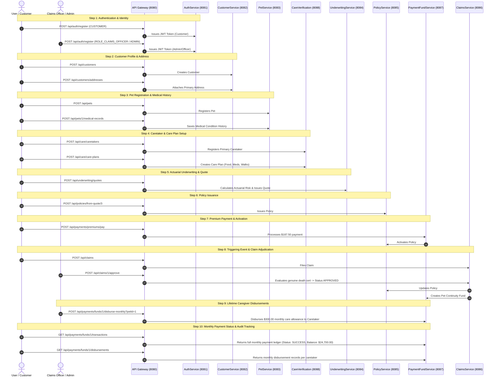

# Pet Continuity Insurance - Complete End-to-End Flow & Data Guide

> **All requests go through API Gateway**: `http://localhost:8080`  
> **Architecture**: Reactive Microservices (`AuthService` 8081, `CustomerService` 8082, `PetService` 8083, `CareVerificationService` 8088, `UnderWritingRiskService` 8084, `PolicyService` 8085, `PaymentFundService` 8087, `ClaimsService` 8086)

---

## Complete Business Flow Diagram



---

## 1. Authentication Service (`AuthService`)
> **Direct Port**: `8081` | **Gateway Route**: `/api/auth/**`

### 1.1 Register Customer Account
* **Endpoint**: `POST http://localhost:8080/api/auth/register`
* **Headers**: `Content-Type: application/json`
* **Request Body**:
```json
{
  "email": "john.doe@example.com",
  "password": "Password123!",
  "role": "CUSTOMER"
}
```
* **Expected Response (`201 CREATED`)**:
```json
{
  "token": "eyJhbGciOiJIUzUxMiJ9...",
  "type": "Bearer",
  "userId": 1,
  "email": "john.doe@example.com",
  "role": "CUSTOMER",
  "expiresIn": 86400000
}
```
> **Action**: Copy the returned `token` as `CUSTOMER_TOKEN`.

### 1.2 Register Claims Officer / Admin Account
* **Endpoint**: `POST http://localhost:8080/api/auth/register`
* **Headers**: `Content-Type: application/json`
* **Request Body**:
```json
{
  "email": "officer@example.com",
  "password": "Password123!",
  "role": "CLAIMS_OFFICER"
}
```
> **Action**: Copy this token as `OFFICER_TOKEN` (needed for Claim Investigation & Approval).

---

## 2. Customer Profile Service (`CustomerService`)
> **Direct Port**: `8082` | **Gateway Route**: `/api/customers/**`

### 2.1 Create Customer Profile
* **Endpoint**: `POST http://localhost:8080/api/customers`
* **Headers**:
  * `Authorization: Bearer <CUSTOMER_TOKEN>`
  * `Content-Type: application/json`
* **Request Body**:
```json
{
  "firstName": "John",
  "lastName": "Doe",
  "email": "john.doe@example.com",
  "phone": "+1-555-0199",
  "dateOfBirth": "1985-06-15",
  "preferredContactMethod": "EMAIL"
}
```
* **Expected Response (`201 CREATED`)**: Returns Customer ID: `1`.

### 2.2 Add Customer Address
* **Endpoint**: `POST http://localhost:8080/api/customers/addresses`
* **Headers**:
  * `Authorization: Bearer <CUSTOMER_TOKEN>`
  * `Content-Type: application/json`
* **Request Body**:
```json
{
  "customerId": 1,
  "addressType": "PRIMARY",
  "streetAddress": "742 Evergreen Terrace",
  "city": "Springfield",
  "stateProvince": "IL",
  "postalCode": "62704",
  "country": "USA",
  "isPrimary": true
}
```

---

## 3. Pet Management Service (`PetService`)
> **Direct Port**: `8083` | **Gateway Route**: `/api/pets/**`

### 3.1 Register Pet
* **Endpoint**: `POST http://localhost:8080/api/pets`
* **Headers**:
  * `Authorization: Bearer <CUSTOMER_TOKEN>`
  * `Content-Type: application/json`
* **Request Body**:
```json
{
  "customerId": 1,
  "petName": "Buddy",
  "species": "DOG",
  "breed": "Golden Retriever",
  "ageYears": 4,
  "weightKg": 31.5,
  "microchipNumber": "985141002345678",
  "gender": "MALE",
  "spayedNeutered": true,
  "isSpecialNeeds": false
}
```
* **Expected Response (`201 CREATED`)**: Returns Pet ID: `1`.

### 3.2 Add Pet Medical Record
* **Endpoint**: `POST http://localhost:8080/api/pets/1/medical-records`
* **Headers**:
  * `Authorization: Bearer <CUSTOMER_TOKEN>`
  * `Content-Type: application/json`
* **Request Body**:
```json
{
  "petId": 1,
  "conditionName": "Mild Hip Dysplasia Checkup",
  "diagnosisDate": "2026-01-10",
  "treatmentPlan": "Joint supplements and light routine exercises",
  "veterinarianName": "Dr. Sarah Adams",
  "clinicName": "Springfield Veterinary Hospital",
  "cost": 150.00,
  "severity": "LOW"
}
```

---

## 4. Care Verification Service (`CareVerificationService`)
> **Direct Port**: `8088` | **Gateway Route**: `/api/care/**`

### 4.1 Register Caretakers
* **Primary Caretaker**: `POST http://localhost:8080/api/care/caretakers`
```json
{
  "firstName": "Robert",
  "lastName": "Smith",
  "relationship": "BROTHER",
  "email": "robert.smith@example.com",
  "phone": "+1-555-0211",
  "address": "123 Elm St, Springfield, IL",
  "notes": "Experienced dog owner, agreed to take Buddy"
}
```
*(Returns Caretaker ID: `1`)*

* **Backup Caretaker**: `POST http://localhost:8080/api/care/caretakers`
```json
{
  "firstName": "Emily",
  "lastName": "Smith",
  "relationship": "SISTER",
  "email": "emily.smith@example.com",
  "phone": "+1-555-0212",
  "address": "456 Oak St, Springfield, IL",
  "notes": "Secondary emergency caretaker"
}
```
*(Returns Caretaker ID: `2`)*

### 4.2 Create Continuity Care Plan
* **Endpoint**: `POST http://localhost:8080/api/care/care-plans`
* **Headers**:
  * `Authorization: Bearer <CUSTOMER_TOKEN>`
  * `Content-Type: application/json`
* **Request Body**:
```json
{
  "petId": 1,
  "primaryCaretakerId": 1,
  "backupCaretakerId": 2,
  "dietaryInstructions": "2 cups Royal Canin Golden Retriever kibble twice daily",
  "medicalInstructions": "Daily Glucosamine chew every morning",
  "dailyRoutine": "30-min morning walk, afternoon yard play, 20-min evening walk",
  "monthlyStipendAmount": 300.00,
  "vetHospitalName": "Springfield Veterinary Hospital",
  "vetPhone": "+1-555-0190"
}
```

---

## 5. Underwriting & Risk Service (`UnderWritingRiskService`)
> **Direct Port**: `8084` | **Gateway Route**: `/api/underwriting/**`

### 5.1 Request Insurance Quote
* **Endpoint**: `POST http://localhost:8080/api/underwriting/quotes`
* **Headers**:
  * `Authorization: Bearer <CUSTOMER_TOKEN>`
  * `Content-Type: application/json`
* **Request Body**:
```json
{
  "customerId": 1,
  "petId": 1,
  "coverageTier": "PREMIUM",
  "baseCoverageAmount": 25000.00,
  "deductibleAmount": 250.00,
  "includeRoutineCare": true
}
```
* **Expected Response (`201 CREATED`)**:
```json
{
  "quoteId": 3,
  "customerId": 1,
  "petId": 1,
  "actuarialRiskScore": 34.5,
  "monthlyPremium": 187.50,
  "annualPremium": 2250.00,
  "coverageAmount": 25000.00,
  "validUntil": "2026-10-22",
  "status": "ISSUED"
}
```

---

## 6. Policy Issuance Service (`PolicyService`)
> **Direct Port**: `8085` | **Gateway Route**: `/api/policies/**`

### 6.1 Issue Policy from Quote
* **Endpoint**: `POST http://localhost:8080/api/policies/from-quote/3`
* **Headers**:
  * `Authorization: Bearer <CUSTOMER_TOKEN>`
  * `Content-Type: application/json`
* **Request Body**: `{}` *(Empty)*
* **Expected Response (`201 CREATED`)**:
```json
{
  "id": 2,
  "policyNumber": "POL-1790093637581-1",
  "customerId": 1,
  "petId": 1,
  "coverageAmount": 25000.0,
  "premiumAmount": 187.50,
  "deductible": 250.0,
  "status": "PENDING_PAYMENT"
}
```

---

## 7. Payment & Fund Service (`PaymentFundService`)
> **Direct Port**: `8087` | **Gateway Route**: `/api/payments/**`

### 7.1 Process Policy Premium Payment
Paying the first monthly premium confirms coverage and automatically switches Policy #2 status from `PENDING_PAYMENT` to `ACTIVE`.
* **Endpoint**: `POST http://localhost:8080/api/payments/premiums/pay`
* **Headers**:
  * `Authorization: Bearer <CUSTOMER_TOKEN>`
  * `Content-Type: application/json`
* **Request Body**:
```json
{
  "policyId": 2,
  "amount": 187.50,
  "paymentMethod": "CREDIT_CARD",
  "transactionReference": "TXN-PET-2026-001"
}
```
* **Expected Response (`200 OK`)**:
```json
{
  "paymentId": 1,
  "policyId": 2,
  "customerId": 1,
  "amount": 187.50,
  "status": "SUCCESS",
  "message": "Premium payment processed successfully and policy activated"
}
```

### 7.2 Verify Policy Activation
* **Endpoint**: `GET http://localhost:8080/api/policies/2`
* **Headers**: `Authorization: Bearer <CUSTOMER_TOKEN>`
* **Status**: Must now show `"status": "ACTIVE"`.

---

## 8. Claims Service (`ClaimsService`)
> **Direct Port**: `8086` | **Gateway Route**: `/api/claims/**`

### 8.1 File Continuity Claim (Triggering Event: Owner Passing)
The designated claimant files the continuity claim with the civil death certificate.
* **Endpoint**: `POST http://localhost:8080/api/claims`
* **Headers**:
  * `Authorization: Bearer <CUSTOMER_TOKEN>`
  * `Content-Type: application/json`
* **Request Body**:
```json
{
  "policyId": 2,
  "claimantName": "Jane Doe",
  "relationship": "SPOUSE",
  "deathCertificateNo": "DC-998877",
  "dateOfDeath": "2026-09-20",
  "notes": "Filing pet continuity care claim following policyholder passing"
}
```
* **Expected Response (`201 CREATED`)**:
```json
{
  "id": 1,
  "claimNumber": "CLM-1790097087664",
  "policyId": 2,
  "claimantName": "Jane Doe",
  "relationship": "SPOUSE",
  "deathCertificateNo": "DC-998877",
  "status": "PENDING"
}
```

### 8.2 Adjudicate / Approve Claim (Officer / Admin)
The claims officer reviews and approves the claim.
* **Endpoint**: `POST http://localhost:8080/api/claims/1/approve`
*(Alternative: `POST http://localhost:8080/api/claims/1/investigate`)*
* **Headers**:
  * `Authorization: Bearer <OFFICER_TOKEN>`
* **Expected Response (`200 OK`)**:
```json
{
  "id": 1,
  "claimNumber": "CLM-1790097087664",
  "policyId": 2,
  "claimantName": "Jane Doe",
  "relationship": "SPOUSE",
  "deathCertificateNo": "DC-998877",
  "status": "APPROVED",
  "investigationDecision": "APPROVED",
  "fraudScore": 10
}
```

---

## 9. Post-Approval Verification & Fund Disbursements

### 9.1 Verify Policy Transitioned to Claim Filed
* **Endpoint**: `GET http://localhost:8080/api/policies/2`
* **Expected Response**:
```json
{
  "id": 2,
  "policyNumber": "POL-1790093637581-1",
  "status": "CLAIM_FILED"
}
```

### 9.2 Inspect Pet Continuity Care Fund
* **Endpoint**: `GET http://localhost:8080/api/payments/funds/by-policy/2`
* **Headers**: `Authorization: Bearer <CUSTOMER_TOKEN>`
* **Expected Response (`200 OK`)**:
```json
{
  "fundId": 1,
  "policyId": 2,
  "petId": 1,
  "totalBalance": 25000.00,
  "allocatedMonthlyAllowance": 300.00,
  "medicalReserve": 4000.00,
  "emergencyReserve": 2000.00,
  "status": "ACTIVE"
}
```

### 9.3 Disburse Monthly Caretaker Allowance (Month 1)
Pay the monthly care allowance ($300.00) to Buddy's caretaker:
* **Endpoint**: `POST http://localhost:8080/api/payments/funds/1/disburse-monthly?petId=1`
* **Headers**: `Authorization: Bearer <OFFICER_TOKEN>`
* **Expected Response (`200 OK`)**:
```json
{
  "disbursementId": 1,
  "fundId": 1,
  "petId": 1,
  "amountDisbursed": 300.00,
  "remainingBalance": 24700.00,
  "status": "DISBURSED"
}
```

### 9.4 Track Monthly Payment Ledger & Status History
To check the exact status of every monthly payment made for the customer's pet:
* **Endpoint**: `GET http://localhost:8080/api/payments/funds/1/transactions`
* **Headers**: `Authorization: Bearer <CUSTOMER_TOKEN>`
* **Expected Response (`200 OK`)**:
```json
[
  {
    "transactionId": 1,
    "fundId": 1,
    "transactionType": "DISBURSEMENT",
    "amount": 300.00,
    "balanceAfter": 24700.00,
    "status": "SUCCESS",
    "description": "Monthly care benefit released to caretaker id 1",
    "createdAt": "2026-09-22T23:15:00"
  }
]
```

### 9.5 Query Monthly Caretaker Disbursements
View the scheduled disbursement audit records per caretaker:
* **Endpoint**: `GET http://localhost:8080/api/payments/funds/1/disbursements`
* **Headers**: `Authorization: Bearer <CUSTOMER_TOKEN>`
* **Expected Response (`200 OK`)**:
```json
[
  {
    "disbursementId": 1,
    "fundId": 1,
    "caretakerId": 1,
    "benefitMonth": "2026-09",
    "amount": 300.00,
    "status": "PROCESSED",
    "processedAt": "2026-09-22T23:15:00"
  }
]
```

### 9.6 Subsequent Months Recurring Payout Cycle
Every month, the payment cycle updates as follows:

| Benefit Month | Payout Amount | Pre-requisite | Payout Endpoint | Resulting Fund Balance | Ledger Status |
| :--- | :--- | :--- | :--- | :--- | :--- |
| **Month 1** | $300.00 | Claim Approved | `POST /api/payments/funds/1/disburse-monthly?petId=1` | **$24,700.00** | `SUCCESS` |
| **Month 2** | $300.00 | Welfare checkup recorded (`POST /api/care/verifications`) | `POST /api/payments/funds/1/disburse-monthly?petId=1` | **$24,400.00** | `SUCCESS` |
| **Month 3** | $300.00 | Welfare checkup recorded | `POST /api/payments/funds/1/disburse-monthly?petId=1` | **$24,100.00** | `SUCCESS` |
| **Month N** | $300.00 | Active caretaker check | `POST /api/payments/funds/1/disburse-monthly?petId=1` | Decrements until depleted | `SUCCESS` |

> [!NOTE]
> If a monthly pet welfare verification check is missed or caretaker becomes non-compliant, the monthly disbursement automatically responds with:
> `"status": "SUSPENDED"`, leaving the fund balance untouched until compliance is renewed.

---

## Quick Reference Summary Table

| Step | Service | Method & Endpoint | Key Payload / Param | Expected Result |
| :--- | :--- | :--- | :--- | :--- |
| **1** | `AuthService` (8081) | `POST /api/auth/register` | `{"email": "...", "role": "CUSTOMER"}` | Customer JWT Token |
| **2** | `AuthService` (8081) | `POST /api/auth/register` | `{"email": "...", "role": "CLAIMS_OFFICER"}` | Claims Officer JWT Token |
| **3** | `CustomerService` (8082) | `POST /api/customers` | `{"firstName": "John", ...}` | Customer ID 1 |
| **4** | `PetService` (8083) | `POST /api/pets` | `{"petName": "Buddy", "breed": "Golden Retriever"}` | Pet ID 1 |
| **5** | `CareVerification` (8088) | `POST /api/care/care-plans` | `{"petId": 1, "monthlyStipendAmount": 300.0}` | Care Plan registered |
| **6** | `Underwriting` (8084) | `POST /api/underwriting/quotes` | `{"customerId": 1, "petId": 1, "coverageTier": "PREMIUM"}` | Quote #3 ($25k coverage, $187.50 premium) |
| **7** | `PolicyService` (8085) | `POST /api/policies/from-quote/3` | `{}` | Policy #2 (`PENDING_PAYMENT`) |
| **8** | `PaymentFundService` (8087) | `POST /api/payments/premiums/pay` | `{"policyId": 2, "amount": 187.50}` | Premium paid $\rightarrow$ Policy #2 `ACTIVE` |
| **9** | `ClaimsService` (8086) | `POST /api/claims` | `{"policyId": 2, "deathCertificateNo": "DC-998877"}` | Claim #1 filed (`PENDING`) |
| **10** | `ClaimsService` (8086) | `POST /api/claims/1/approve` | `{}` | Claim `APPROVED`, Policy `CLAIM_FILED`, $25k Fund created |
| **11** | `PaymentFundService` (8087) | `POST /api/payments/funds/1/disburse-monthly?petId=1` | `?petId=1` | $300.00 care allowance disbursed (Balance: $24,700) |
| **12** | `PaymentFundService` (8087) | `GET /api/payments/funds/1/transactions` | `{}` | Full monthly payment ledger (`status: SUCCESS`) |
| **13** | `PaymentFundService` (8087) | `GET /api/payments/funds/1/disbursements` | `{}` | Caretaker disbursement audit (`status: PROCESSED`) |

