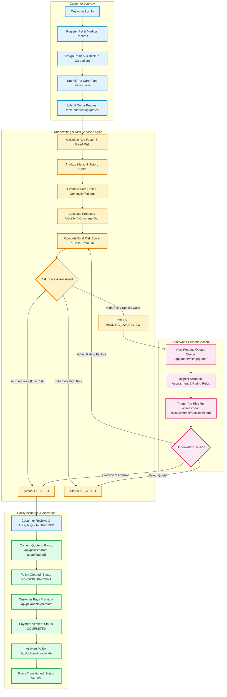
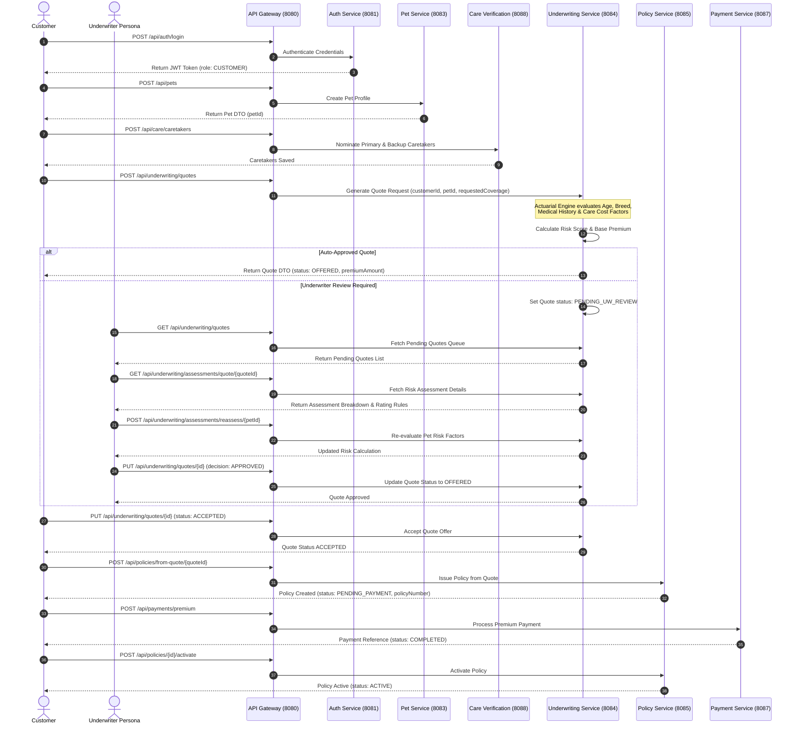

# Pet Continuity Assurance System - Policy & Underwriting Workflow Diagram

This document contains the detailed end-to-end Mermaid sequence and flowchart diagrams for the **Policy Creation and Underwriting Workflow**, including explicit actions performed by the **Customer**, **Underwriting System**, **Underwriter Persona**, **Policy Service**, and **Payment Service**.

---

## 1. Policy & Underwriting Flowchart

---

## 2. Policy & Underwriting Detailed Sequence Diagram

