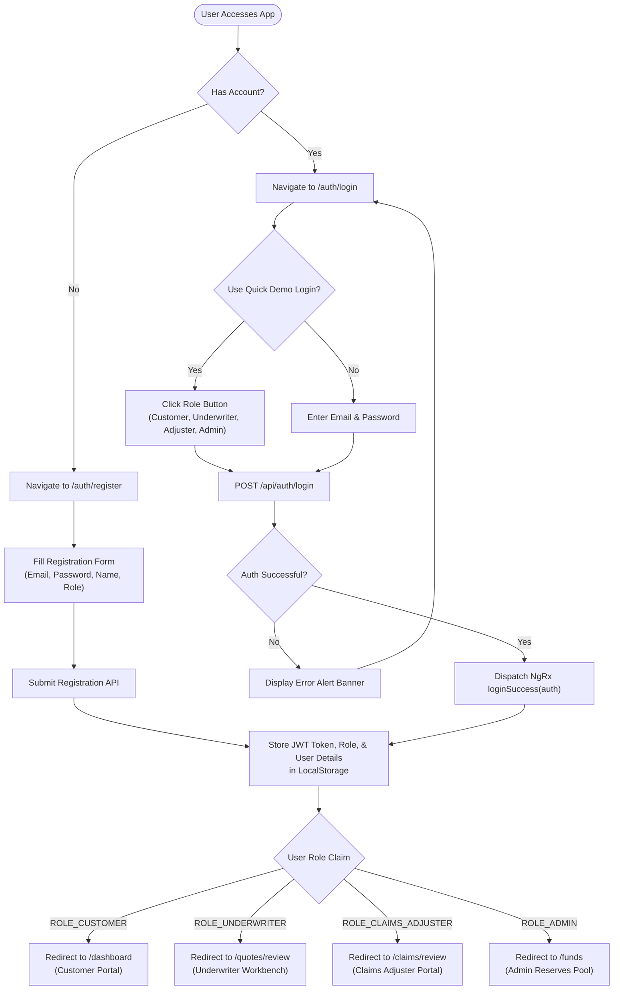
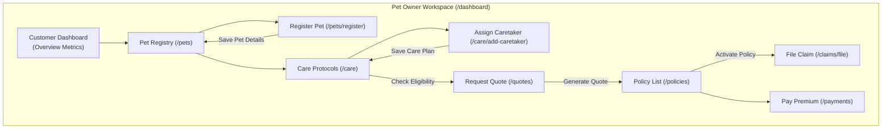
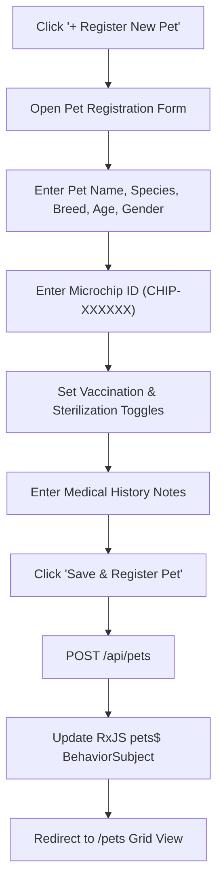
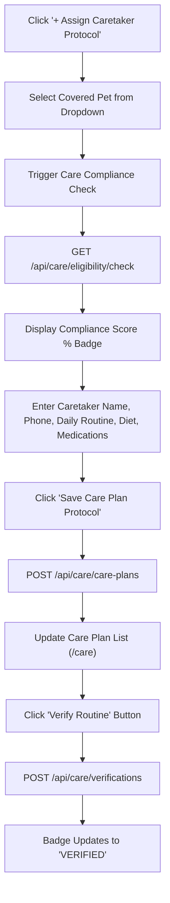
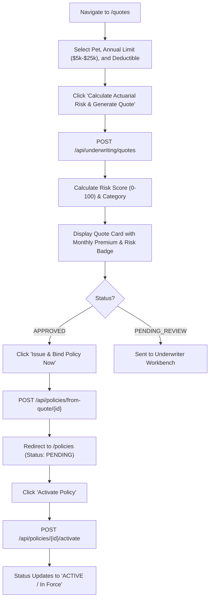
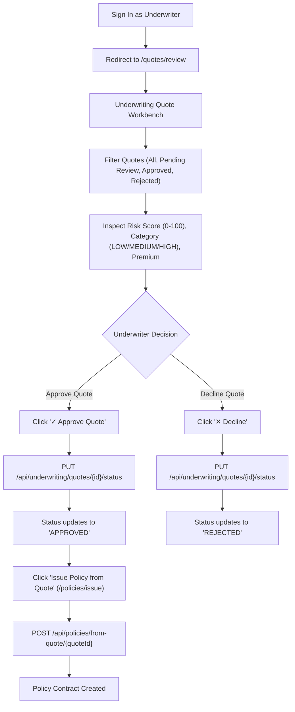
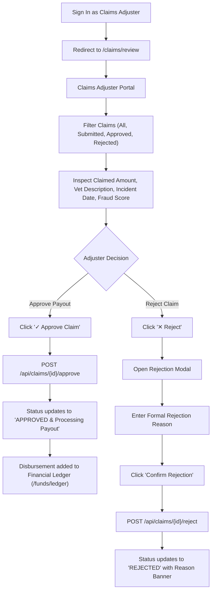
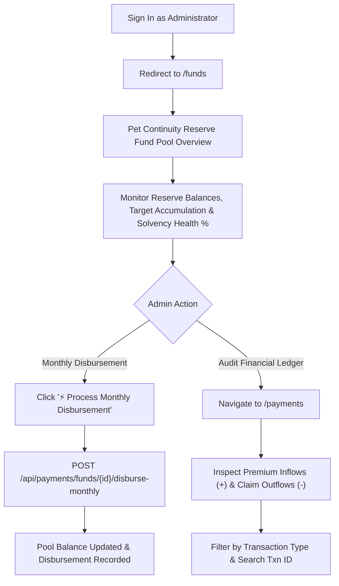

# Pet Continuity Insurance System - User Flow Diagrams & Role Workflows

This document details the end-to-end frontend operational workflows and state transitions for each user role within the **Pet Continuity Insurance System**. All diagrams are authored using **Mermaid.js** syntax for easy rendering in GitHub, Antigravity IDE, and Markdown previewers.

---

## 1. System Overview & Authentication Flow

Before accessing any role-specific workspace, users register or log in via the JWT Authentication module.

---

## 2. Role 1: Pet Owner Workflow (`ROLE_CUSTOMER`)

The Pet Owner portal guarantees pet continuity protection by orchestrating pet registration, care protocol formulation, actuarial quote generation, policy activation, claim filing, and monthly premium payments.

### 2.1 Complete Pet Owner End-to-End User Journey

### 2.2 Pet Registration & Medical History Flow

### 2.3 Caretaker Assignment & Care Verification Flow

### 2.4 Quote Generation & Policy Binding Flow

### 2.5 Claim Submission & Premium Online Payment Flow

```mermaid
flowchart TD
    subgraph ClaimFlow["Claim Filing"]
        FileClick["Navigate to /claims/file"] --> ClaimInputs["Enter Policy ID, Pet ID, Claim Amount, Incident Date"]
        ClaimInputs --> Evidence["Enter Veterinary Description & Evidence Summary"]
        Evidence --> SubmitClaim["Click 'Submit Continuity Claim'"]
        SubmitClaim --> PostClaim["POST /api/claims"]
        PostClaim --> RedirectAdjuster["Forwarded to Claims Adjuster Queue"]
    end

    subgraph PaymentFlow["Premium Payment"]
        PayClick["Click 'Pay Premium Online' on /payments"] --> OpenModal["Open Payment Modal"]
        OpenModal --> SelectMethod["Select Amount & Payment Method (Credit Card / ACH / PayPal)"]
        SelectMethod --> ClickPay["Click 'Pay $XX.XX'"]
        ClickPay --> PostPay["POST /api/payments/premium"]
        PostPay --> UpdateLedger["Inflow Transaction added to Financial Ledger"]
    end
```

---

## 3. Role 2: Underwriting Specialist Workflow (`ROLE_UNDERWRITER`)

The Underwriter evaluates actuarial risk parameters, reviews manually flagged quotes, approves or rejects coverage requests with notes, and binds insurance contracts.

---

## 4. Role 3: Claims Adjuster Workflow (`ROLE_CLAIMS_ADJUSTER`)

The Claims Adjuster verifies incident reports, inspects fraud scores, adjudicates claim amounts, approves payout disbursements, or issues formal rejection notices.

---

## 5. Role 4: System Administrator Workflow (`ROLE_ADMIN`)

The System Administrator oversees the Pet Continuity Reserve Fund Pool, monitors pool solvency health, triggers monthly caretaker payouts, and audits all financial transactions.

---

## 6. Route & Component Navigation Matrix

| Route Path | Permission Guard | Role Access | Primary Action / View |
| :--- | :--- | :--- | :--- |
| `/auth/login` | Public | Visitor / All Roles | Sign In & Quick Demo Login |
| `/auth/register` | Public | Visitor / All Roles | Register New Account |
| `/dashboard` | `authGuard` | `ROLE_CUSTOMER` | Customer Overview & Metrics |
| `/profile` | `authGuard` | `ROLE_CUSTOMER` | Edit Personal Profile |
| `/pets` | `authGuard` | `ROLE_CUSTOMER`, `ROLE_ADMIN` | Pet Search & Species Filter |
| `/pets/register` | `authGuard` | `ROLE_CUSTOMER` | Register New Pet Profile |
| `/care` | `authGuard` | `ROLE_CUSTOMER` | Care Protocols & Verification |
| `/care/add-caretaker` | `authGuard` | `ROLE_CUSTOMER` | Formulate Care Routine |
| `/quotes` | `authGuard` | `ROLE_CUSTOMER`, `ROLE_UNDERWRITER` | Request Actuarial Quote |
| `/quotes/review` | `authGuard` | `ROLE_UNDERWRITER` | Underwriting Risk Workbench |
| `/policies` | `authGuard` | All Roles | View Policy Contracts |
| `/policies/issue` | `authGuard` | `ROLE_UNDERWRITER` | Bind Policy from Quote |
| `/claims` / `/claims/file` | `authGuard` | `ROLE_CUSTOMER`, `ROLE_CLAIMS_ADJUSTER` | File Continuity Claim |
| `/claims/review` | `authGuard` | `ROLE_CLAIMS_ADJUSTER` | Claims Adjuster Workbench |
| `/payments` / `/funds/ledger` | `authGuard` | All Roles | Financial Ledger & Pay Premium |
| `/funds` / `/admin/funds` | `authGuard` | `ROLE_ADMIN` | Reserve Pool Solvency |

---

> [!NOTE]
> All flow diagrams are fully rendered using Mermaid syntax. Users can preview these flowcharts in GitHub, IDE Markdown previewers, or Mermaid Live Editor.
